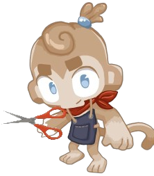

<h1 align="center">

HairStylistMonkey

</h1>

This mod adds a new monkey to the game.

In the settings menu there are setting to give things in the game "hair".
This has a few glitches probably but it works pretty well and doesn't require restarting the game. You can even change the settings from the mod menu in the pause screen of a game.

If you increase the slider to the max, well then I think it would go together with tewtiy's cursed towers series.

